# Jaska robot development environment
## Build
Dockerfile is based on https://github.com/atinfinity/l4t-ros2-docker/tree/main/jazzy
```
# on target
docker build -t ghcr.io/haitomatic/jaska-dev:base .
docker build -t ghcr.io/haitomatic/jaska-dev:lidar .
```

## Usage
### Lidar
```
# ZED BOX
docker run -it --rm --name jaska_lidar --network host --privileged -v ~/haito_dev:/home/jetson/haito_dev -e ROS_DOMAIN_ID=1 -e RMW_IMPLEMENTATION=rmw_fastrtps_cpp -e ROS_AUTOMATIC_DISCOVERY_RANGE=SUBNET -v /dev:/dev ghcr.io/haitomatic/jaska-dev:base bash

# DEV PC
export ROS_DOMAIN_ID=1
export RMW_IMPLEMENTATION=rmw_fastrtps_cpp
export ROS_AUTOMATIC_DISCOVERY_RANGE=SUBNET
rviz2 -d /home/haito/haito_dev/ros2_ws/src/jaska-dev/rviz/lio.rviz

# record and playback
docker run -d --name jaska_lidar --network host --privileged -v ~/haito_dev:/home/jetson/haito_dev -e ROS_DOMAIN_ID=1 -e RMW_IMPLEMENTATION=rmw_fastrtps_cpp -e ROS_AUTOMATIC_DISCOVERY_RANGE=LOCALHOST -v /dev:/dev ghcr.io/haitomatic/jaska-dev:base bash -c "source /home/jetson/haito_dev/ros2_ws/install/setup.bash && cd /home/jetson/haito_dev/jaska-dev/lidar_utils && ros2 launch unitree_lidar_ros2 launch.py record_bag:=true"
docker kill --signal=SIGINT jaska_lidar
ros2 bag play unitree_l2_mapping_data
ros2 bag info unitree_l2_mapping_data

# Basic LIO
ros2 bag play unitree_l2_mapping_data
ros2 launch point_lio mapping_unilidar_l2.launch.py

# Basic LIO onboard
docker run --name jaska_lidar --network host --privileged -v ~/haito_dev:/home/jetson/haito_dev -v /tmp/.X11-unix:/tmp/.X11-unix:rw -e DISPLAY=:0 -e ROS_DOMAIN_ID=1 -e RMW_IMPLEMENTATION=rmw_fastrtps_cpp -e ROS_AUTOMATIC_DISCOVERY_RANGE=LOCALHOST -v /dev:/dev ghcr.io/haitomatic/jaska-dev:demo bash -c "source /home/jetson/haito_dev/ros2_ws/install/setup.bash && ros2 launch unitree_lidar_ros2 launch.py record_bag:=false & sleep 10 && source /home/jetson/haito_dev/ros2_ws/install/setup.bash && ros2 launch point_lio mapping_unilidar_l2.launch.py"
```


### Mapping
#### Installation
*Install GTSAM (4.1.1)*
```bash
wget -O gtsam.zip https://github.com/borglab/gtsam/archive/refs/tags/4.1.1.zip
unzip gtsam.zip
cd gtsam-4.1.1/
mkdir build && cd build
cmake -DGTSAM_BUILD_WITH_MARCH_NATIVE=OFF -DGTSAM_USE_SYSTEM_EIGEN=ON ..
sudo make install -j16
```
*Install TEASER++*
```bash
git clone https://github.com/MIT-SPARK/TEASER-plusplus.git
cd TEASER-plusplus && mkdir build && cd build
cmake .. -DENABLE_DIAGNOSTIC_PRINT=OFF
sudo make install -j16
sudo ldconfig
```
*Install TBB*
```bash
sudo apt install -y libtbb-dev
```
*Upstream components*
```
git clone https://github.com/haitomatic/Localization-QN.git
git clone https://github.com/haitomatic/SAM-QN.git
git clone https://github.com/illusionaryshelter/Quatro.git
git clone https://github.com/illusionaryshelter/nano_gicp.git
```

#### Build
```
rosdep update
rosdep install --from-paths src --ignore-src -r -y
colcon build --symlink-install
```

#### Execution
```
source install/setup.bash
ros2 launch jaska_dev mapping.launch.py
# another terminal
ros2 bag play <path_to_ros2_bag>
```


### Camera

#### ZED ROS2 Node Topics

| **Node** | **Topic** | **Type** | **Message Type** | **Description** |
|----------|-----------|----------|------------------|-----------------|
| **zed_wrapper** | `/zed/zed_node/rgb/image_rect_color` | Pub | `sensor_msgs/Image` | Rectified RGB image |
| | `/zed/zed_node/rgb/camera_info` | Pub | `sensor_msgs/CameraInfo` | RGB camera calibration |
| | `/zed/zed_node/left/image_rect_color` | Pub | `sensor_msgs/Image` | Left rectified image |
| | `/zed/zed_node/left/camera_info` | Pub | `sensor_msgs/CameraInfo` | Left camera calibration |
| | `/zed/zed_node/right/image_rect_color` | Pub | `sensor_msgs/Image` | Right rectified image |
| | `/zed/zed_node/right/camera_info` | Pub | `sensor_msgs/CameraInfo` | Right camera calibration |
| | `/zed/zed_node/depth/depth_registered` | Pub | `sensor_msgs/Image` | Depth map aligned to RGB |
| | `/zed/zed_node/depth/camera_info` | Pub | `sensor_msgs/CameraInfo` | Depth camera calibration |
| | `/zed/zed_node/point_cloud/cloud_registered` | Pub | `sensor_msgs/PointCloud2` | 3D point cloud |
| | `/zed/zed_node/disparity/disparity_image` | Pub | `stereo_msgs/DisparityImage` | Disparity map |
| | `/zed/zed_node/confidence/confidence_image` | Pub | `sensor_msgs/Image` | Confidence map |
| | `/zed/zed_node/odom` | Pub | `nav_msgs/Odometry` | Visual odometry |
| | `/zed/zed_node/pose` | Pub | `geometry_msgs/PoseStamped` | Camera pose |
| | `/zed/zed_node/pose_with_covariance` | Pub | `geometry_msgs/PoseWithCovarianceStamped` | Camera pose with uncertainty |
| | `/zed/zed_node/path_odom` | Pub | `nav_msgs/Path` | Odometry trajectory |
| | `/zed/zed_node/path_map` | Pub | `nav_msgs/Path` | Map trajectory |
| | `/zed/zed_node/imu/data` | Pub | `sensor_msgs/Imu` | IMU data (if available) |
| | `/zed/zed_node/imu/data_raw` | Pub | `sensor_msgs/Imu` | Raw IMU data |
| | `/zed/zed_node/temperature/imu` | Pub | `sensor_msgs/Temperature` | IMU temperature |
| | `/zed/zed_node/temperature/left` | Pub | `sensor_msgs/Temperature` | Left camera temperature |
| | `/zed/zed_node/temperature/right` | Pub | `sensor_msgs/Temperature` | Right camera temperature |
| | `/zed/zed_node/atm_press` | Pub | `sensor_msgs/FluidPressure` | Atmospheric pressure |
| | `/zed/zed_node/height` | Pub | `sensor_msgs/Range` | Height from ground |
| | `/tf` | Pub | `tf2_msgs/TFMessage` | Transform tree |
| | `/tf_static` | Pub | `tf2_msgs/TFMessage` | Static transforms |

#### ZED Package Dependencies

```mermaid
graph TD
    %% External ROS2 Dependencies
    A[sensor_msgs] --> D[zed_wrapper]
    B[geometry_msgs] --> D
    C[nav_msgs] --> D
    E[stereo_msgs] --> D
    F[tf2_ros] --> D
    G[image_transport] --> D
    H[camera_info_manager] --> D
    I[diagnostic_updater] --> D
    J[xacro] --> D
    K[robot_localization] --> D

    %% ZED-specific packages
    L[zed_msgs] --> D[zed_wrapper]
    L --> M[zed_components]

    %% Internal ZED dependencies
    D --> M
    D --> N[zed_display_rviz2]

    %% Meta package
    O[zed_ros2] --> D
    O --> M
    O --> N
    O --> L

    %% External custom dependencies
    P[nmea_msgs] --> D
    Q[geographic_msgs] --> D
    R[backward_ros] --> D
    S[point_cloud_transport] --> D
    T[point_cloud_transport_plugins] --> D

    %% Styling
    classDef zedPkg fill:#2E8B57,stroke:#fff,stroke-width:2px,color:#fff
    classDef rosPkg fill:#4682B4,stroke:#fff,stroke-width:2px,color:#fff
    classDef metaPkg fill:#8B4513,stroke:#fff,stroke-width:2px,color:#fff

    class L,D,M,N zedPkg
    class A,B,C,E,F,G,H,I,J,K,P,Q,R,S,T rosPkg
    class O metaPkg
```



#### Build Docker Image
```bash
docker build -f Dockerfile.camera -t ghcr.io/haitomatic/jaska-dev:camera .
```

#### Run Camera Container
```bash
xhost +
docker run -it --rm --name jaska_camera \
  --gpus all \
  --runtime=nvidia \
  --privileged  \
  --network=host \
  --ipc=host \
  --pid=host \
  -v /tmp/.X11-unix:/tmp/.X11-unix:rw \
  -v /dev:/dev \
  -v /tmp:/tmp \
  -v /home/user/.Xauthority:/root/.Xauthority:rw \
  -v /tmp/argus_socket:/tmp/argus_socket \
  -v /var/nvidia/nvcam/settings/:/var/nvidia/nvcam/settings/ \
  -v /etc/systemd/system:/etc/systemd/system \
  -v /etc/systemd/system/zed_x_daemon.service:/etc/systemd/system/zed_x_daemon.service \
  -e DISPLAY=$DISPLAY \
  -e XAUTHORITY=/root/.Xauthority \
  -e XDG_RUNTIME_DIR=/tmp/runtime-dir \
  -e ROS_DOMAIN_ID=1 \
  -e RMW_IMPLEMENTATION=rmw_fastrtps_cpp \
  -e ROS_AUTOMATIC_DISCOVERY_RANGE=SUBNET \
  ghcr.io/haitomatic/jaska-dev:camera bash
```
#### Tests and Examples
```
# On ZED box, start the docker container
## Optional precheck
nvidia-smi
### only work with GUI
/usr/local/zed/tools/ZED_Explorer
### -c for headless mode (for ex: ssh)
/usr/local/zed/tools/ZED_Diagnostic -c

## start zed ros2 wrapper node. For all launch option, add `-s` or for more info: https://www.stereolabs.com/docs/ros2
ros2 launch zed_wrapper zed_camera.launch.py camera_model:=zedx

## troubleshooting
sudo dpkg --purge stereolabs-zedbox-duo # remove current duo gmsl2 driver
sudo dpkg -i stereolabs-zedbox-duo_1.3.2-LI-MAX96712-all-ZEDBOX-L4T36.4.0_arm64.deb # install correct quad gmsl2 driver
# there might be issue with l4t-kernel pkg. Check https://www.stereolabs.com/docs/embedded/zed-box-orin/troubleshooting#error-package-nvidia-l4t-kernel-is-not-configured-yet-while-installing-the-zed-x-driver
sudo systemctl restart nvargus-daemon.service
sudo systemctl restart zed_x_daemon.service


# On DEV PC
## zed ros2 wrapper and zed ros2 examples deps installation and build
### install CUDA 12.8
wget https://developer.download.nvidia.com/compute/cuda/repos/ubuntu2404/x86_64/cuda-keyring_1.1-1_all.deb
sudo dpkg -i cuda-keyring_1.1-1_all.deb
sudo apt-get update
sudo apt-get -y install cuda-toolkit-12-8
echo 'export PATH=/usr/local/cuda-12.8/bin:$PATH' >> ~/.bashrc
echo 'export LD_LIBRARY_PATH=/usr/local/cuda-12.8/lib64:$LD_LIBRARY_PATH' >> ~/.bashrc
### install zed sdk for the same CUDA version from https://www.stereolabs.com/en-fi/developers/release using instruction at https://www.stereolabs.com/docs/development/zed-sdk/linux
### in ros2 ws, clone both repos
### rosdep (this will install zed_msgs too so no need to pull repo)
rosdep install --from-paths src/zed-ros2-wrapper src/zed-ros2-examples --ignore-src -r -y
### build
colcon build --symlink-install --cmake-args=-DCMAKE_BUILD_TYPE=Release --parallel-workers $(nproc) --packages-up-to zed_display_rviz2
## We use rviz2. For more info: https://www.stereolabs.com/docs/ros2/rviz2
export ROS_DOMAIN_ID=1
export RMW_IMPLEMENTATION=rmw_fastrtps_cpp
export ROS_AUTOMATIC_DISCOVERY_RANGE=SUBNET
ros2 launch jaska-dev zed_camera_rviz.launch.py

## Option 2: Manual Launch (Original Method)
### For live camera (this use case)
rviz2 -d /home/haito/haito_dev/ros2_ws/src/jaska-dev/rviz/zed_stereo.rviz --ros-args -p use_sim_time:=false
### For recorded data / sim
rviz2 -d /home/haito/haito_dev/ros2_ws/src/jaska-dev/rviz/zed_stereo.rviz --ros-args -p use_sim_time:=true
```

#### SVO2 data recording
```
# Building data recording container image
docker build -f Dockerfile.camera_python -t jaska-dev:camera-python .

# Run the recording container on Jaska
xhost +
export DISPLAY=:0  # require when running over ssh but has display connected
docker run -it --rm --name jaska_camera   --gpus all   --runtime=nvidia   --privileged   --network=host   --ipc=host   --pid=host   -v /tmp/.X11-unix:/tmp/.X11-unix:rw   -v /dev:/dev   -v /tmp:/tmp   -v /home/user/.Xauthority:/root/.Xauthority:rw   -v /tmp/argus_socket:/tmp/argus_socket   -v /var/nvidia/nvcam/settings/:/var/nvidia/nvcam/settings/   -v /etc/systemd/system:/etc/systemd/system   -v /etc/systemd/system/zed_x_daemon.service:/etc/systemd/system/zed_x_daemon.service -v /usr/local/zed/resources:/usr/local/zed/resources -v /home/user/haito_dev/zedx_recording:/Jaska/zedx_recording  -e DISPLAY=$DISPLAY   -e XAUTHORITY=/root/.Xauthority   -e XDG_RUNTIME_DIR=/tmp/runtime-dir   jaska-dev:camera-python
```
